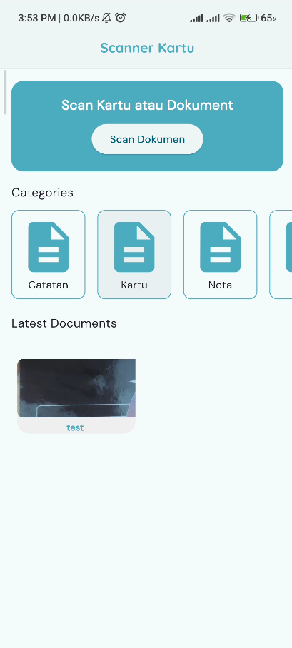

# Flutter Scan App

**Flutter Scan App** is a Flutter application designed to scan and manage documents efficiently using **Google ML Kit Document Scanner** and **Sqflite** for local storage.

## Features

- **Document Scanning**: Capture documents using Google ML Kit's document scanning feature.
- **Document Categorization**: Organize scanned documents into categories.
- **Local Storage**: Store documents locally using Sqflite.
- **Responsive UI**: Optimized for portrait mode with customized app theming using Google Fonts.
- **Save as PDF or Image**: The app allows users to save scanned documents as PDFs or as Images direcly.
- **Delete Document**: Users can delete a saved document, and the app offers a confirmation dialog before deletion.

## Screenshots
<!-- tampilkan dalam bentuk tabel-->
| Feature | Screenshot |
| --- | --- |
| Home Page |  |
| Save Document Scanning |  |
| Document Categorization |  |
| Edit Document |  |
| Detail Document |  |

## Getting Started

### Prerequisites

Ensure you have Flutter installed. Follow the [Flutter installation guide](https://flutter.dev/docs/get-started/install) if you don't have it set up.

### Installation

1. Clone this repository:

   ```bash
   git clone https://github.com/IlhamGhaza/flutter_scan_app.git
   ```

2. Navigate to the project directory:

   ```bash
   cd flutter_scan_app
   ```

3. Install dependencies:

   ```bash
   flutter pub get
   ```

### Running the Application

To run the app on an emulator or physical device:

```bash
flutter run
```

### Project Structure

- **lib/main.dart**: The entry point of the app.
- **lib/pages**: Contains different page widgets for the app.
- **lib/core**: Core functionalities and utilities such as custom styles and widgets.
- **lib/data**: Contains models and local data sources.

### Key Packages Used

- [google_mlkit_document_scanner](https://pub.dev/packages/google_mlkit_document_scanner) for document scanning.
- [sqflite](https://pub.dev/packages/sqflite) for local data storage.
- [google_fonts](https://pub.dev/packages/google_fonts) for custom fonts.

## Acknowledgments

- [Google ML Kit](https://developers.google.com/ml-kit) for providing the document scanning feature.
- [Sqflite](https://pub.dev/packages/sqflite) for local database storage.
- [Flutter](https://flutter.dev) for the framework.

## Contributing

Contributions are welcome! Please feel free to submit pull requests or report issues.
<!-- ## Contact

For any questions or feedback, please contact the project maintainer at [mail](mailto:cb7ezeur@selenakuyang.anonaddy.com). -->

## License

This project is licensed under the MIT License - see the [LICENSE](https://github.com/IlhamGhaza/flutter_scan_app/blob/main/LICENSE) file for details.
